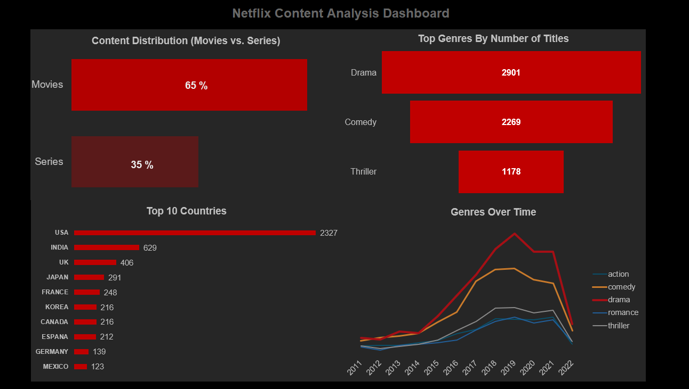
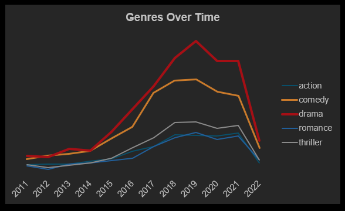
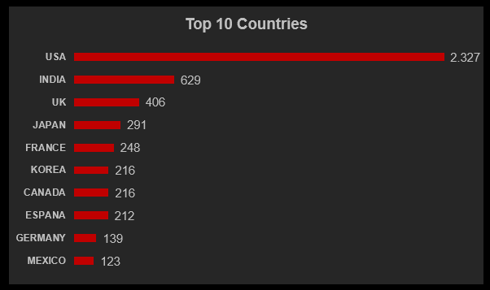

# Netflix Dashboard

Interactive Netflix dashboard combining SQL-based data analysis with Excel data visualization to uncover content trends and insights.

---

## 📊 Dashboard Preview



---

## 📌 Project Overview

This project analyzes Netflix content data to identify trends in:

- content distribution (Movies vs. Series)
- most popular genres
- geographical distribution of titles
- genre development over time

The workflow combines **SQL for data preparation** and **Excel for visualization**.

---

## 🧠 Key Insights

- Movies dominate the catalog with approximately **65%**, while series account for **35%**
- **Drama and Comedy** are the most common genres
- The **United States** leads by a significant margin in content production
- Content production increased strongly between **2016–2019**, followed by a decline
- Genre trends show consistent dominance of mainstream categories

---

## 📈 Visualizations

### Content Distribution


---

### Top Genres



---

### Top 10 Countries



---

### Genres Over Time


---

## 🗂️ Project Structure
```
Netflix-Dashboard/
│
├── data/
│ ├── titles_clean.csv
│ └── credits_clean.csv
│
├── dashboard/
│ └── netflix-dashboard.xlsx
│
├── docs/
│ └── screenshots/
│ ├── netflix-dashboard.png
│ ├── top-genres.png
│ └── top-10-countries.png
│
└── README.md
```

---

## ⚙️ Tools & Technologies

- **Excel** – dashboard creation & visualization  
- **SQL** – data transformation and analysis  
- **GitHub** – project documentation and version control  

---

## 📊 Data Source

The dataset is based on a cleaned version of the Netflix titles and credits dataset.

---

## 🚀 How to Use

1. Download the Excel file from `/dashboard`
2. Open in Excel
3. Explore the dashboard and visual insights

---

## 📌 Author

Nicole Kaufmann

